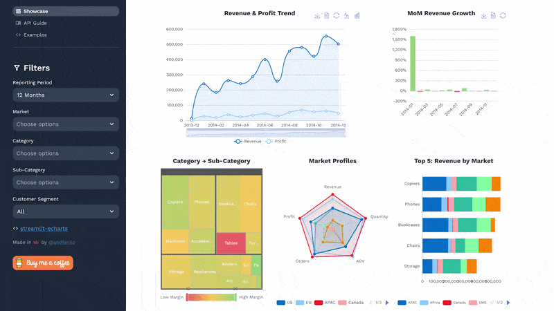

# Streamlit - ECharts

[](https://share.streamlit.io/andfanilo/streamlit-echarts-demo/master/app.py)

A custom component to run Echarts in Streamlit session.

It's basically a Streamlit wrapper over [echarts-for-react](https://github.com/hustcc/echarts-for-react).



## Install

```shell script
pip install streamlit-echarts
```

## Usage

This library provides 2 functions to display echarts :

- `st_echarts` to display charts from echarts json options as Python dicts
- `st_pyecharts` to display charts from Pyecharts instances

Check the `examples/` folder of the project for a more thourough quick start.

**st_echarts example**

```python
from streamlit_echarts import st_echarts

options = {
    "xAxis": {
        "type": "category",
        "data": ["Mon", "Tue", "Wed", "Thu", "Fri", "Sat", "Sun"],
    },
    "yAxis": {"type": "value"},
    "series": [
        {"data": [820, 932, 901, 934, 1290, 1330, 1320], "type": "line"}
    ],
}
st_echarts(options=options)
```

**st_pyecharts example**

```python
from pyecharts import options as opts
from pyecharts.charts import Bar
from streamlit_echarts import st_pyecharts

b = (
    Bar()
    .add_xaxis(["Microsoft", "Amazon", "IBM", "Oracle", "Google", "Alibaba"])
    .add_yaxis(
        "2017-2018 Revenue in (billion $)", [21.2, 20.4, 10.3, 6.08, 4, 2.2]
    )
    .set_global_opts(
        title_opts=opts.TitleOpts(
            title="Top cloud providers 2018", subtitle="2017-2018 Revenue"
        ),
        toolbox_opts=opts.ToolboxOpts(),
    )
)
st_pyecharts(b)
```

### st_echarts API

```
st_echarts(
    options: Dict
    theme: Union[str, Dict]
    events: Dict[str, str]
    height: str
    width: str
    renderer: str
    key: str
)
```

- **options** : Python dictionary that resembles the JSON counterpart of
  [echarts options](https://echarts.apache.org/en/tutorial.html#ECharts%20Basic%20Concepts%20Overview).
  For example the basic line chart in JS :

```javascript
option = {
  xAxis: {
    type: "category",
    data: ["Mon", "Tue", "Wed", "Thu", "Fri", "Sat", "Sun"],
  },
  yAxis: { type: "value" },
  series: [{ data: [820, 932, 901, 934, 1290, 1330, 1320], type: "line" }],
};
```

is represented in Python :

```python
option = {
    "xAxis": {
        "type": "category",
        "data": ["Mon", "Tue", "Wed", "Thu", "Fri", "Sat", "Sun"],
    },
    "yAxis": { "type": "value" },
    "series": [
        {"data": [820, 932, 901, 934, 1290, 1330, 1320], "type": "line" }
    ],
}
```

- **theme** : [echarts theme](https://echarts.apache.org/en/tutorial.html#Overview%20of%20Style%20Customization).
  You can specify built-int themes or pass over style configuration as a Pythcon dict.
- **events** : Python dictionary which maps an [event](https://echarts.apache.org/en/tutorial.html#Events%20and%20Actions%20in%20ECharts) to a Js function as string.
  For example :

```python
{
    "click": "function(params) { console.log(params.name) }"
}
```

will get mapped to :

```javascript
myChart.on("click", function (params) {
  console.log(params.name);
});
```

- **height** / **width** : size of the div wrapper
- **renderer** : SVG or canvas
- **key** : assign a fixed identity if you want to change its arguments over time and not have it be re-created.

### Using st_pyecharts

```python
def st_pyecharts(
    chart: Base
    theme: Union[str, Dict]
    events: Dict[str, str]
    height: str
    width: str
    renderer: str
    key: str
)
```

- **chart** : Pyecharts instance

The docs for the remaining inputs are the same as its `st_echarts` counterpart.

## Development

### Install

- JS side

```shell script
cd frontend
npm install
```

- Python side

```shell script
conda create -n streamlit-echarts python=3.7
conda activate streamlit-echarts
pip install -e .
```

### Run

Both webpack dev server and Streamlit need to run for development mode.

- JS side

```shell script
cd frontend
npm run start
```

- Python side

Demo example is on https://github.com/andfanilo/streamlit-echarts-demo.

```shell script
git clone https://github.com/andfanilo/streamlit-echarts-demo
cd streamlit-echarts-demo/
streamlit run app.py
```

## Caveats

### Theme definition

- Defining the theme in Pyecharts when instantiating chart like `Bar(init_opts=opts.InitOpts(theme=ThemeType.LIGHT))`
  does not work, you need to call theme in `st_pyecharts(c, theme=ThemeType.LIGHT)`.

### Maps definition

- For now only china map is loaded. Need to find a way how to load json maps or from URL.

### On Javascript functions

This library also provides the `JsCode` util class directly from `pyecharts`.

This class is used to indicate javascript code by wrapping it with a specific placeholder.
On the custom component side, we parse every value in options looking for this specific placeholder
to determine whether a value is a JS function.

As such, if you want to pass JS functions as strings in your options,
you should use the corresponding `JsCode` module to wrap code with this placeholder :

- In Python dicts representing the JSON option counterpart,
  wrap any JS string function with `streamlit_echarts.JsCode` by calling `JsCode(function).jscode`.
  It's a smaller version of `pyecharts.commons.utils.JsCode` so you don't need to install `pyecharts` to use it.

```
series: [
    {
        type: 'scatter', // this is scatter chart
        itemStyle: {
            opacity: 0.8
        },
        symbolSize: JsCode("function (val) { return val[2] * 40;}").js_code,
        data: [["14.616","7.241","0.896"],["3.958","5.701","0.955"],["2.768","8.971","0.669"],["9.051","9.710","0.171"],["14.046","4.182","0.536"],["12.295","1.429","0.962"],["4.417","8.167","0.113"],["0.492","4.771","0.785"],["7.632","2.605","0.645"],["14.242","5.042","0.368"]]
    }
]
```

- In Pyecharts, use `pyecharts.commons.utils.JsCode` directly, JsCode automatically calls `.jscode` when dumping options.

```
.set_series_opts(
        label_opts=opts.LabelOpts(
            position="right",
            formatter=JsCode(
                "function(x){return Number(x.data.percent * 100).toFixed() + '%';}"
            ),
        )
    )
```

### st_pyecharts VS using pyecharts with components.html

While this package provides a `st_pyecharts` method, if you're using `pyecharts` you can directly embed your pyecharts visualization inside `st.html`
by passing the output of the chart's `.render_embed()`.

```python
from pyecharts.charts import Bar
from pyecharts import options as opts
import streamlit.components.v1 as components

c = (Bar()
    .add_xaxis(["Microsoft", "Amazon", "IBM", "Oracle", "Google", "Alibaba"])
    .add_yaxis('2017-2018 Revenue in (billion $)', [21.2, 20.4, 10.3, 6.08, 4, 2.2])
    .set_global_opts(title_opts=opts.TitleOpts(title="Top cloud providers 2018", subtitle="2017-2018 Revenue"),
                     toolbox_opts=opts.ToolboxOpts())
    .render_embed() # generate a local HTML file
)
components.html(c, width=1000, height=1000)
```

Using `st_pyecharts` is still something you would want if you need to change data regularly
without remounting the component, check for examples `examples/app_pyecharts.py` for `Chart with randomization` example.


